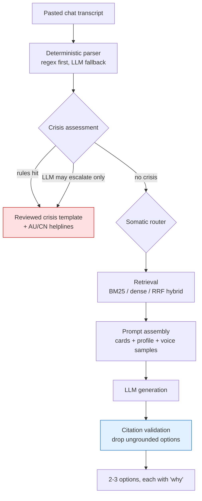

# HeartBridge

**A retrieval-grounded assistant that helps the partner of someone with depression decide what to say — and understand why it works.**

You paste the conversation you're stuck in. HeartBridge classifies the risk level, retrieves relevant grounded guidance, and returns 2–3 reply options — each one carrying the mechanism behind it, not just a script to copy.

> ⚠️ HeartBridge is a communication-skills assistant. It is not therapy, it does not diagnose, and it is not a crisis service. Every response carries a disclaimer and escalation resources.

---

## Why this exists

Partners and family members are the people most often in the room when someone with depression is struggling, and they are almost never given anything usable. "What do I actually say right now" is a real, recurring, high-stakes question, and the advice available online is scattered, unsourced and generic. Clinical guidance exists — Beyond Blue and Healthdirect publish good material — but it is written to be read calmly in advance, not consulted at 2am mid-conversation.

HeartBridge is built for that moment: retrieval over structured, sourced guidance, returned as concrete options with the reasoning attached.

It is also deliberately built as an engineering artefact. Every design decision below was made against a measurement rather than a preference, and where a measurement contradicted the popular choice, the measurement won.

---

## What's interesting about it (engineering)

| Decision | Why |
|---|---|
| **Safety constraints live in the type system, not the prompt** | A somatic-symptom card without an authoritative source raises at load time. Prompt instructions are best-effort; type constraints are not. |
| **Crisis detection is rules-first, LLM-second, and asymmetric** | The LLM may only *escalate* risk. A non-deterministic component is never allowed to silence a safety signal that has already fired. |
| **Crisis responses are hardcoded templates, not generated** | On the highest-risk path, predictability and auditability beat personalisation. A template can be reviewed word-by-word by a human and asserted line-by-line in tests. |
| **Every reply option must cite a retrieved card, and the citation is validated** | A citation to a card that was not retrieved is a hallucination, and is dropped before the user sees it. |
| **Two evaluation sets, and the honest one is the lower one** | The dev set scores 100%. It's contaminated. The held-out set scores 36.7%. Both are reported. |
| **All LLM calls sit behind one interface with a deterministic mock** | The entire 83-test suite runs offline, free, and reproducibly. |

---

## Results

**Retrieval** (30 cards). Two sets; the held-out one is the number that counts.

| Backend | Dev R@1 | Dev R@3 | **Held-out R@1** | **Held-out R@3** | Held-out MRR |
|---|---|---|---|---|---|
| BM25 | 90.6% | 100.0% | 33.3% | 36.7% | 0.350 |
| **Dense** (bge-small-zh) | 87.5% | 96.9% | **60.0%** | **76.7%** | **0.672** |
| Hybrid (RRF) | 90.6% | 100.0% | 40.0% | 70.0% | 0.522 |

Two findings that changed the code:

- **The dev set is contaminated and the 100% is meaningless.** Each card's document-expansion terms were written after inspecting dev-set failures — test-set leakage. The held-out set was authored independently, entirely from paraphrased queries, and BM25 drops from 100% to 36.7% on it.
- **Hybrid retrieval lost to dense alone on the held-out set** (70.0% vs 76.7%). RRF weights both retrievers equally; when one is substantially weaker, fusion drags the result down. "Hybrid is always better" did not survive contact with the measurement, so the default backend is `dense`.

Full methodology in [`docs/EVALUATION.md`](docs/EVALUATION.md).

**Crisis detection** (41 cases: 14 crisis / 8 elevated / 19 normal, 10 of them adversarial)

| Metric | Result |
|---|---|
| Crisis recall | **100%** (14/14) — zero tolerance |
| False-positive rate | **0%** (0/19) |
| Severity downgrades | 0 |

The first evaluation run caught 3 genuine misses. Rules were fixed and the cases locked in as tests.

---

## Architecture



The crisis branch short-circuits **before** retrieval and generation, so a crisis response never depends on model state.

Core logic lives in `core/` as a plain Python package with no framework dependency. CLI, and any future Discord bot or web UI, are thin callers. See [`docs/ARCHITECTURE.md`](docs/ARCHITECTURE.md).

---

## Quick start

```bash
git clone <this repo> && cd heartbridge
python3 -m venv .venv && source .venv/bin/activate
pip install -r requirements.txt

# Demo mode — no API key, deterministic mock LLM
python scripts/advise.py --demo --profile examples/sample_profile.json --text "小鱼 23:45
我觉得我就是个废物"

# Reproduce every number in this README
python scripts/eval_retrieval.py --set both      # retrieval
python scripts/eval_index_ablation.py            # index-text ablation
python scripts/eval_safety.py                    # crisis detection
pytest -q                                        # 83 tests
```

For real generation, copy `.env.example` to `.env` and set a provider (OpenRouter or Gemini).
For dense/hybrid retrieval, additionally `pip install sentence-transformers`.

---

## Privacy

A partner's mental-health information is the most sensitive category of personal data there is. The design reflects that:

- **Local-first.** Profile and transcripts live in SQLite on the user's own machine. `data/` is gitignored in full.
- **Data minimisation.** Every profile field is optional; empty fields are not even injected into prompts.
- **Local embeddings.** `bge-small-zh` runs on CPU, so retrieval never sends the user's text to a third party. The privacy requirement drove the model choice, not the other way round.
- **Erasure.** `delete_profile()` exists and is covered by a test.
- **The demo deployment uses fabricated data only.**

---

## Repository layout

```
core/
  config.py            all model names, thresholds, paths — no hardcoding
  knowledge/           card schema, BM25 / dense / RRF retrieval, evaluator
  safety/              two-stage crisis detector, crisis templates
  engine/              prompt assembly, generation, citation validation, pipeline
  profile/             partner profile model + local SQLite store
  utils/               LLM abstraction (OpenRouter / Gemini / Mock), transcript parser
knowledge_base/cards/  30 curated cards, every one with a source
tests/                 83 tests; fixtures hold both evaluation sets
scripts/               reproducible evaluation + CLI
docs/                  architecture, evaluation methodology
```

## Knowledge base sourcing

All 30 cards are distilled from public clinical-education material, primarily [Beyond Blue](https://www.beyondblue.org.au/) and [Healthdirect Australia](https://www.healthdirect.gov.au/). Every card carries a `source` field. Somatic-symptom cards **structurally cannot exist** without an authoritative source — the model validator rejects them.

## Status & roadmap

Working today: knowledge base, retrieval + evaluation, crisis detection, reply generation, CLI.
Next: dense-retrieval numbers on the held-out set, a video→ASR→distillation ingestion pipeline for Chinese-language creator content, a Streamlit UI, and a Discord bot.

## Licence

MIT
